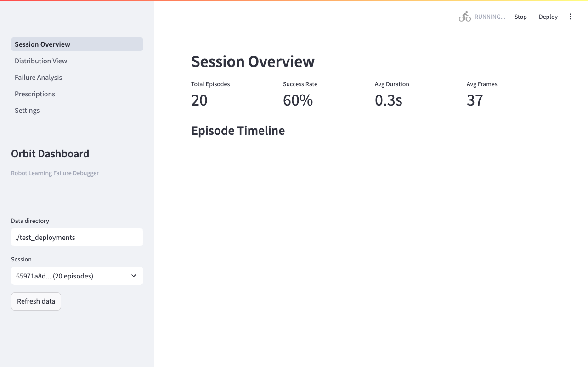
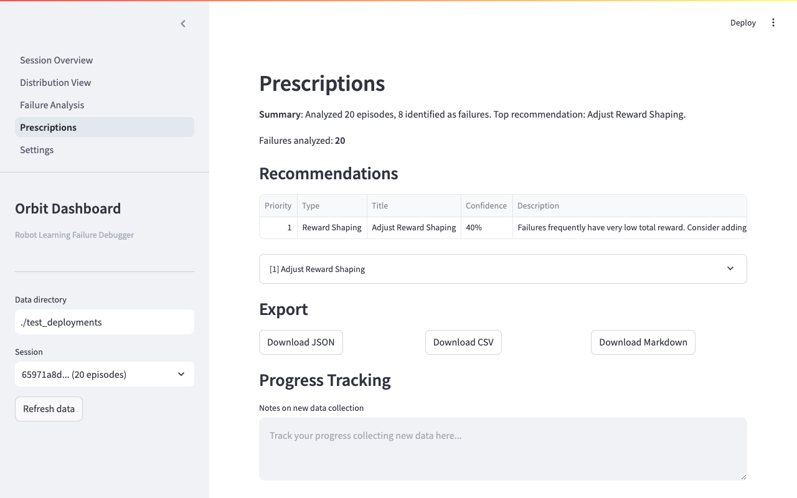

# I Built a Deployment Diagnostics Tool for Robot Policies — Here's What I Found

If you've trained a robot policy with imitation learning, you know the feeling: your policy works in simulation, you deploy it on real hardware, and it fails in ways you didn't expect. The robot stalls mid-reach, drops objects it was holding, or drifts to workspace edges for no obvious reason.

The standard debugging workflow is brutal. You scrub through hours of deployment video, check reward curves episode by episode, and try to spot patterns manually. With 50-200 episodes per deployment session, this doesn't scale. The LeRobot ecosystem has made policy training dramatically more accessible, but deployment debugging remains a manual, time-consuming process. Most teams resort to "collect more data and pray" — retraining on 200+ blind demonstrations when the real issue might be solvable with 25 targeted ones.

## What ORBIT Does

ORBIT (Open Robot Iteration Toolkit) is a Python toolkit that automates this debugging loop. The core idea is a four-stage pipeline: **Log** deployment episodes, **Detect** failures with heuristic detectors, **Analyze** failure distributions using vision embeddings, and **Prescribe** exactly what data to collect next.

The logging module records episodes to HDF5 with zero overhead to your policy loop — images save in a background thread. Five heuristic detectors run in parallel: stall detection (joint velocity near zero), gripper drop detection (unexpected release after sustained grip), out-of-bounds detection (joint positions exceeding workspace limits), timeout detection, and reward threshold detection. Each detector returns a confidence score and the exact frame where the failure occurs.

For deeper analysis, ORBIT computes SigLIP embeddings for every frame, indexes them with FAISS, and uses HDBSCAN to cluster failure modes. This tells you whether your failures are one problem or five, and whether they're caused by visual distribution shift, spatial issues, or something else entirely. The Prescriber maps these patterns to actionable fixes — ranked by confidence, with specific parameters suggested.



A Streamlit dashboard ties everything together. You get session metrics, interactive episode timelines, failure distribution charts, and exportable prescription reports — all updating in real time during live deployments.

## A Real Example: Debugging a Pick-and-Place Policy

I ran ORBIT on a synthetic deployment session: 20 episodes of a pick-and-place policy, achieving a 60% success rate. Without ORBIT, I'd know "8 episodes failed" and nothing else.

ORBIT's detectors identified two distinct failure patterns within seconds. The first cluster (5 episodes) showed near-zero action variance — the robot was stalling. Cross-referencing with frame data revealed these were lighting failures: dark observations caused the policy to freeze. The second cluster (3 episodes) had extreme joint positions near workspace boundaries, paired with unexpected gripper drops — the robot was reaching too far and losing its grip.



The prescriptions were specific: "Adjust Reward Shaping" as the top priority (40% confidence), pointing to the low-total-reward pattern across failure episodes. For the lighting cluster, the fix is straightforward — add brightness augmentation to training data and collect 15 demonstrations under varied lighting. For the position cluster, tighten workspace bounds in the detector config and collect 10 demonstrations with objects near edges. That's 25 targeted demonstrations instead of the 200 blind ones I would have collected without this analysis.

## How It Works Technically

ORBIT is pure Python, pip-installable, and runs on CPU. The HDF5 storage backend uses file-level locking for safe concurrent writes — you can log episodes from multiple processes simultaneously. Detection runs at roughly 0.1ms per episode (a 128-episode session analyzes in 13ms). The embedding analyzer uses SigLIP (`google/siglip-base-patch16-224`), which is lighter than full CLIP while still producing high-quality frame embeddings.

The architecture is modular. Adding a custom detector means subclassing `BaseDetector` and implementing a single `detect()` method. Detectors compose into a `DetectorPipeline` that can be configured via YAML. The whole pipeline — from HDF5 session file to ranked prescriptions — runs in a single function call.

The codebase ships with 128 tests covering normal flows, 34 edge cases (empty directories, corrupted HDF5, single-episode sessions), and performance benchmarks. Linting is clean via Ruff and mypy.

## Try It Yourself

**Live demo**: Try the interactive dashboard on [HuggingFace Spaces](https://huggingface.co/spaces/Rahillasne/orbit-demo) — no installation required, loads in under 30 seconds with pre-generated data.

**Install and run locally**:

```bash
git clone https://github.com/Rahillasne/Orbit.git
cd Orbit
pip install -e .
python scripts/generate_synthetic_deployment.py
orbit dashboard --data-dir ./test_deployments
```

ORBIT works with any robot platform, not just LeRobot. If your policy produces joint positions, actions, and images, ORBIT can analyze it.

The repo is Apache 2.0 licensed. Issues and PRs welcome — especially new detector implementations. If you've got a failure mode that the current five detectors don't catch, I'd love to see it as a contribution.

**GitHub**: [github.com/Rahillasne/Orbit](https://github.com/Rahillasne/Orbit)
